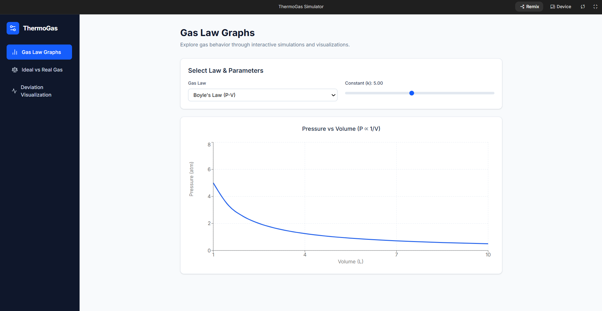
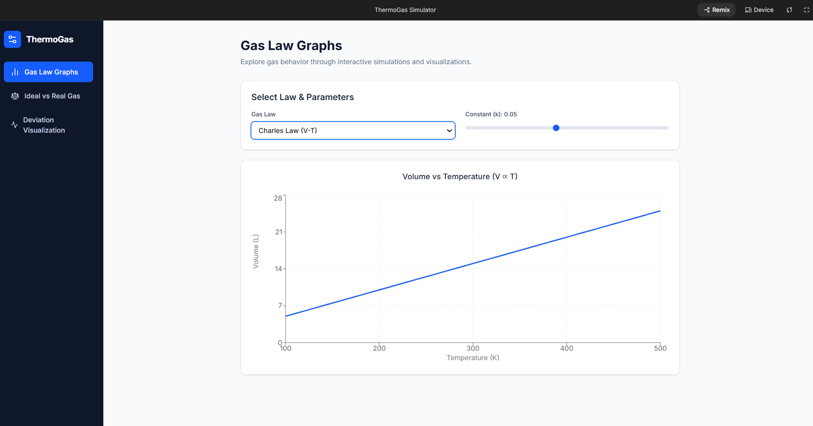
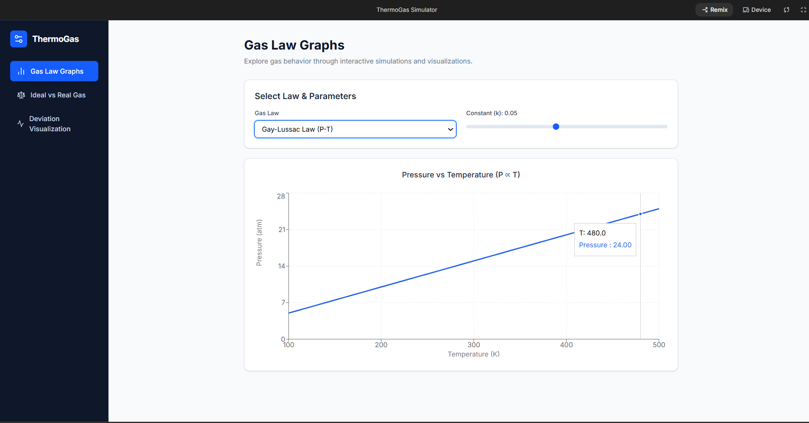
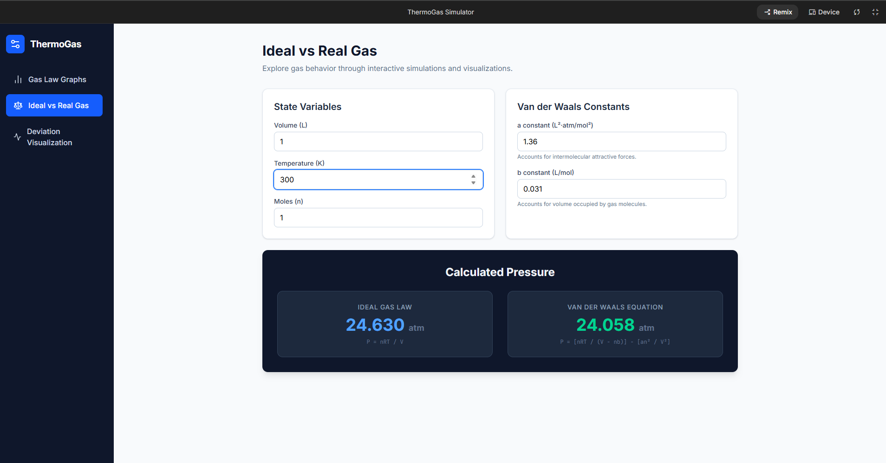
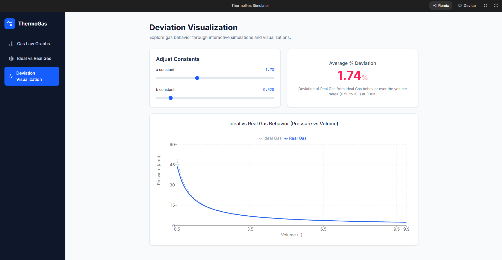

###ThermoGas: Interactive Ideal vs Real Gas Behavior Simulator

## Course Details
Subject: Introduction to Computational Chemistry  
Professor: Dr. Saurav Prasad  
Institution: Vellore Institute of Technology (VIT Bhopal)  
Semester: Winter Semester 2025  

## Student Contributors: 
Lipsa Rani Panda(25BCE10034)
Preeti Chauhan(25BCE10546)

##  Project Description

**ThermoGas** is an interactive computational chemistry application designed to simulate, analyze, and visualize the behavior of gases under different thermodynamic conditions.

This project combines fundamental concepts of thermodynamics and gas laws into a single user-friendly platform. It allows users to explore:

- Classical gas laws (Boyle’s, Charles’, Gay-Lussac)
- Differences between Ideal and Real gases
- Graphical representation of gas behavior
- Deviation of real gases from ideal conditions

The application is built using **Python and Streamlit**, providing an intuitive interface for real-time interaction and visualization.

---

##  Objectives

- To understand and visualize thermodynamic gas laws
- To compare ideal and real gas behavior
- To analyze deviations using graphical methods
- To create an interactive and educational computational tool

##  Features

#1. Gas Law Graph Generator

This module allows users to visualize the fundamental gas laws:

#### ➤ Boyle’s Law (P ∝ 1/V)
- Graph: Pressure vs Volume (P-V)
- Demonstrates inverse relationship
- Useful for constant temperature systems

#### ➤ Charles’ Law (V ∝ T)
- Graph: Volume vs Temperature (V-T)
- Shows linear relationship
- Applicable at constant pressure

#### ➤ Gay-Lussac Law (P ∝ T)
- Graph: Pressure vs Temperature (P-T)
- Demonstrates direct proportionality
- Used for constant volume conditions

**Features:**
- Interactive sliders for variables
- Real-time graph updates
- Clear visualization of relationships

---

###  2. Ideal vs Real Gas Simulator

This module compares theoretical and real-world gas behavior.

#### ➤ Ideal Gas Equation:
PV = nRT

#### ➤ Real Gas Equation (Van der Waals):
(P + a/V²)(V - b) = nRT

##  Technologies Used
- **Python**
- **Streamlit** (for UI)
- **NumPy** (numerical calculations)
- **Matplotlib / Plotly** (graph plotting)
- **Pandas** (data handling)

---

##  Project Structure
ThermoGas-Interactive-Ideal-vs-Real-Gas-Behavior-Simulator/  

│
├── app.py # Main Streamlit application  

├── README.md # Project documentation  

├── requirements.txt # Dependencies  

│
├── modules/ # Core logic  

│ ├── gas_laws.py  

│ ├── ideal_gas.py  

│ ├── real_gas.py  

│ ├── deviation.py  

│ ├── compressibility.py  

│
├── graphs/ # Graph generation  

│ ├── gas_law_graphs.py  

│ ├── comparison_graphs.py  

│
├── data/ # Gas constants dataset  

│ ├── gas_constants.csv  

│
├── utils/ # Helper functions  

│ ├── constants.py  

│ ├── helpers.py  

│
└── assets/ # Screenshots for README  

├── screenshots/  

#### Screenshots

### Dashboard

### Gas Law Graph

###  Ideal vs Real Gas

### Deviation Visualization

